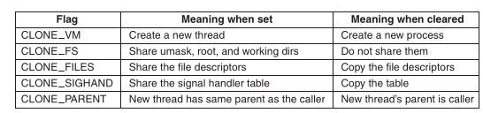
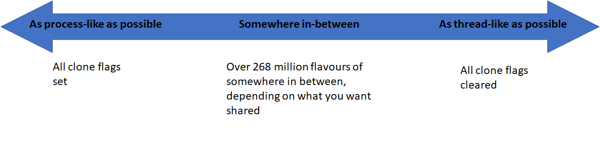
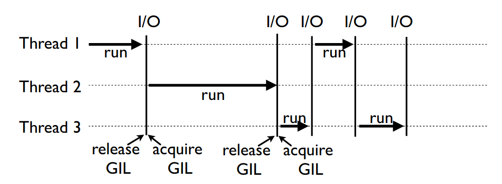

- [Процесс](#org130f06c)
- [Поток](#org4ca9479)
- [Что можно узнать про процесс?](#orgf70362d)
- [создание процессов](#org24cfce9)
- [создание потоков](#org463eac9)
- [CPU-bound / IO-bound задачи](#org1fc9cd3)
- [GIL](#orgf554a77)
- [GIL](#orga3a3a4d)
- [GIL](#org4ddb7a8)
- [GIL](#org83e2536)
- [Практика](#org2a8d7d1)
- [Дополнительная литература](#org6e2e9a0)
- [Что такое Celery?](#org6840141)
- [Практика запуска задач на Celery](#org2be2019)
- [Практика запуска задач на Celery](#org677dc40)
- [Celery и Django](#org82487d4)
- [Что такое map-reduce](#org7ad481a)
- [Практика запуска map-reduce на pyspark](#org746ed0e)
- [Практика запуска map-reduce на pyspark](#org627af95)
- [Вопросы-ответы](#org7704a55)


<a id="org130f06c"></a>

# Процесс

Это программа, находящаяся в режиме выполнения. Операционная система подгружает в оперативную память с каждым процессом  

-   Саму программу
-   Данные к программе
-   Стек программы

Переключение между процессами происходит на уровне ядра.  


<a id="org4ca9479"></a>

# Поток

****Потоков не существует! Есть только процессы, но чуть-чуть другие \Smiley[][yellow]****  
  

-   Каждый процесс состоит из минимум одного потока.
-   Потоки разделяют общее адресное пространство процесса.

<span class="underline"><span class="underline">[подробнее (SO)](https://stackoverflow.com/a/809049)</span></span>  


<a id="orgf70362d"></a>

# Что можно узнать про процесс?

```shell
# посмотреть все процессы
ps alx
# посмотреть все процессы пользователя
ps a -u
ps a -u redis
# добавить информацию о тредах
ps -eLf
# здесь "хранится" процесс
ls -l /proc/<PID>/
```


<a id="org24cfce9"></a>

# создание процессов

Для создания нового процесса используются системные вызовы копирования процесса:  

-   **clone:** UNIX-системы
-   **CreateProcess:** Win2k-системы


<a id="org463eac9"></a>

# создание потоков

В Linux это тот же $clone$, только мы говорим ему, не копировать память, а "шарить"  
  


<a id="org1fc9cd3"></a>

# CPU-bound / IO-bound задачи

-   **CPU-bound:** задачи, которые активно используют CPU. Арифметические операции, матричные вычисления, поиск строк, и т.д.
-   **IO-bound:** задачи, связанные с вводом-выводом данных. Работа с сетью, с файловыми системами, с пользовательским вводом


<a id="orgf554a77"></a>

# GIL

<span class="underline"><span class="underline">[Python/ceval.c](https://github.com/python/cpython/blob/e62a694fee53ba7fc16d6afbaa53b373c878f300/Python/ceval.c#L238)</span></span>  

```C
/* This is the GIL */
static PyThread_type_lock
       interpreter_lock = 0;
```


<a id="orga3a3a4d"></a>

# GIL

GIL гарантирует интерпретатору, что только один *поток* может быть запущен в текущий момент. Это сделано для безопасной работы управления памятью, вызова расширений написанных на других языках (на C).  


<a id="org4ddb7a8"></a>

# GIL

  

-   sys.getcheckinterval()  # -> Python2
-   sys.getswitchinterval() # -> Python3


<a id="org83e2536"></a>

# GIL

GIL замедляет CPU-bound задачи. Старая реализация GIL очень плохо работала с *CPU-bound + IO-bound* задачами. <span class="underline"><span class="underline">[Пример](https://dabeaz.blogspot.com/2010/01/python-gil-visualized.html)</span></span>, да и новая не лучше.  


<a id="org2a8d7d1"></a>

# Практика

<span class="underline"><span class="underline">[GitHub](https://github.com/pimiento/python_threads_examples/)</span></span>  


<a id="org6e2e9a0"></a>

# Дополнительная литература

-   <span class="underline"><span class="underline">[GIL](https://realpython.com/python-gil/)</span></span>
-   <span class="underline"><span class="underline">[UnderstandingGIL.pdf](https://www.dabeaz.com/python/UnderstandingGIL.pdf)</span></span>
-   <span class="underline"><span class="underline">[Groking The GIL](https://opensource.com/article/17/4/grok-gil)</span></span>
-   <span class="underline"><span class="underline">[GIL и его влияние на многопоточность в Python](https://habr.com/ru/post/592189/)</span></span>
-   <span class="underline"><span class="underline">[multiprocessing](https://docs.python.org/3/library/multiprocessing.html)</span></span>


<a id="org6840141"></a>

# Что такое Celery?

<span class="underline"><span class="underline">[Официальная документация](https://docs.celeryproject.org/en/stable/getting-started/introduction.html)</span></span>  
\newline{}  
*Celery* это брокер задач, который позволяет в фоновом, асинхронном режиме выполнять задачи в отдельных процессах/тредах и/или на других машинах.  


<a id="org2be2019"></a>

# Практика запуска задач на Celery

```shell
pip install celery
apt install rabbitmq-server
```

-   <span class="underline"><span class="underline">[Можно описывать сложные последовательности](https://docs.celeryq.dev/en/stable/getting-started/next-steps.html#groups)</span></span>


<a id="org677dc40"></a>

# Практика запуска задач на Celery

```shell
cd celery_example
docker compose up -d
celery -A tasks worker --loglevel=INFO
./runner.py
```


<a id="org82487d4"></a>

# Celery и Django

  


<a id="org7ad481a"></a>

# Что такое map-reduce

Это процесс решения больших задач при помощи разбивки данных на части и решения задач с частями данных на разных машинах. MapReduce состоит из обязательных шагов:  

1.  Map — разбить данные на блоки (присвоить каждой записи некоторый ключ блока)
2.  Shuffle — присвоить каждому блоку некоторый ключ (*не-уникальный* между всеми блоками)
3.  Reduce — для каждого ключа выполнить некоторую функцию над всеми данными в этом ключе


<a id="org746ed0e"></a>

# Практика запуска map-reduce на pyspark

*[тестовая сборка для работы с Hadoop](https://medium.com/analytics-vidhya/how-to-easily-install-hadoop-with-docker-ad094d556f11) (надо дополнительно поставить python на namenode)*  

-   <span class="underline"><span class="underline">[mapper.py](https://github.com/pimiento/python_threads_examples/blob/main/mapper.py)</span></span>
-   <span class="underline"><span class="underline">[reducer.py](https://github.com/pimiento/python_threads_examples/blob/main/reducer.py)</span></span>


<a id="org627af95"></a>

# Практика запуска map-reduce на pyspark

-   запуск на NameNode  
    
    ```shell
    hdfs dfs -rm -r -skipTrash\
         /d/out
    hadoop jar /opt/hadoop-2.7.4/share\
           /hadoop/tools/lib/\
           hadoop-streaming-2.7.4.jar\
           -files /root/mapper.py,\
           /root/reducer.py\
           -mapper /root/mapper.py\
           -reducer /root/reducer.py\
           -input /d/in/98.txt\
           -output /d/out
    hdfs dfs -cat /d/out/part-00000
    ```


<a id="org7704a55"></a>

# Вопросы-ответы


